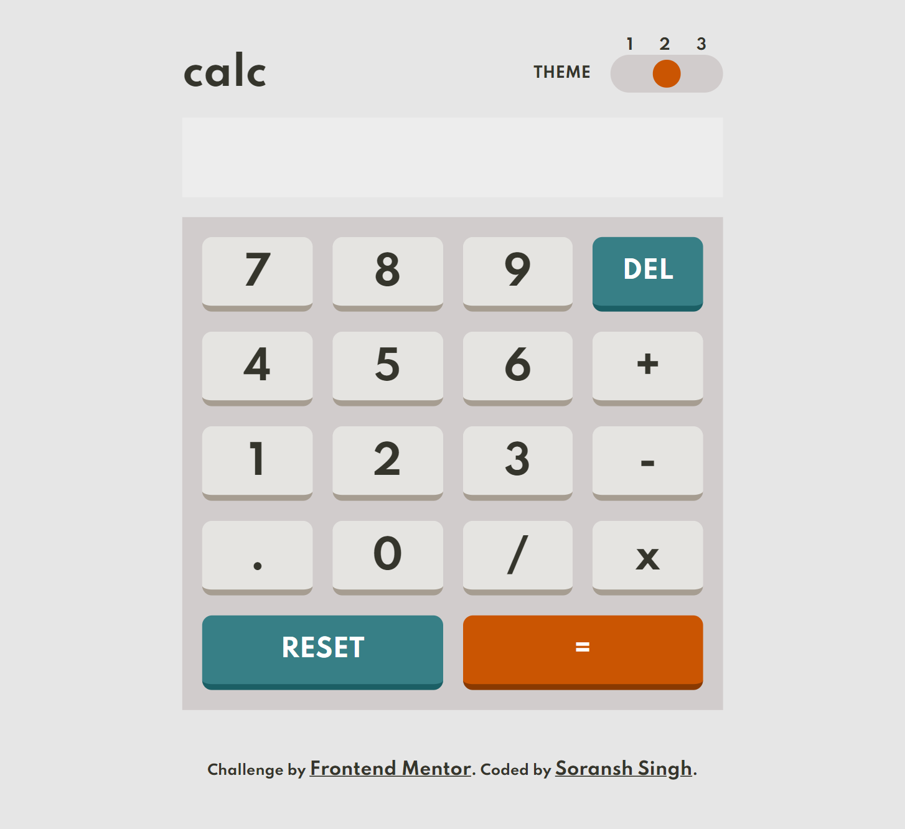

# Frontend Mentor - Calculator app

## Welcome! 👋

This is a solution to the [Calculator app challenge on Frontend Mentor](https://www.frontendmentor.io/challenges/calculator-app-9lteq5N29). Frontend Mentor challenges help you improve your coding skills by building realistic projects.

## Table of contents
- [Overview](#overview)
  - [The challenge](#the-challenge)
  - [Screenshot](#screenshot)
  - [Links](#links)
- [My process](#my-process)
  - [Built with](#built-with)
  - [Continued development](#continued-development)
- [Author](#author)

### The challenge
Users should be able to:

- See the size of the elements adjust based on their device's screen size
- Perform mathmatical operations like addition, subtraction, multiplication, and division
- Adjust the color theme based on their preference

### Screenshot

### Links

- Solution URL: [Add solution URL here](https://your-solution-url.com)
- Live Site URL: [Add live site URL here](https://your-live-site-url.com)

## My process
first tried to write the HTML then worked on the layout after that added functionality so that simple calculation can be implemented and then made the switch that changes the theme.

### Built with

- Semantic HTML5 markup
- CSS custom properties
- Flexbox
- CSS Grid
- vanillaJS

### Continued development

there can be still some logical error or bugs in the working of Calculator and switch have a room of improvement.

## Author

- Website - [Soransh Singh](https://soransh-singh.github.io/)
- Frontend Mentor - [@soransh-singh](https://www.frontendmentor.io/profile/soransh-singh)
